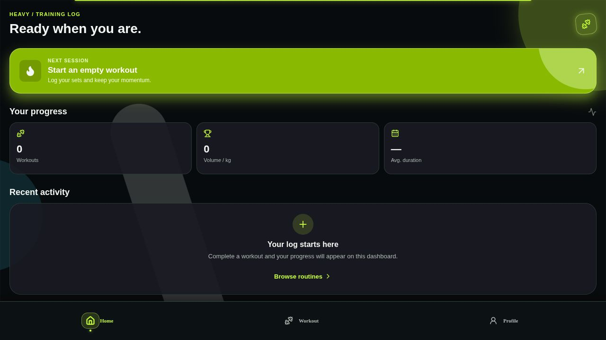
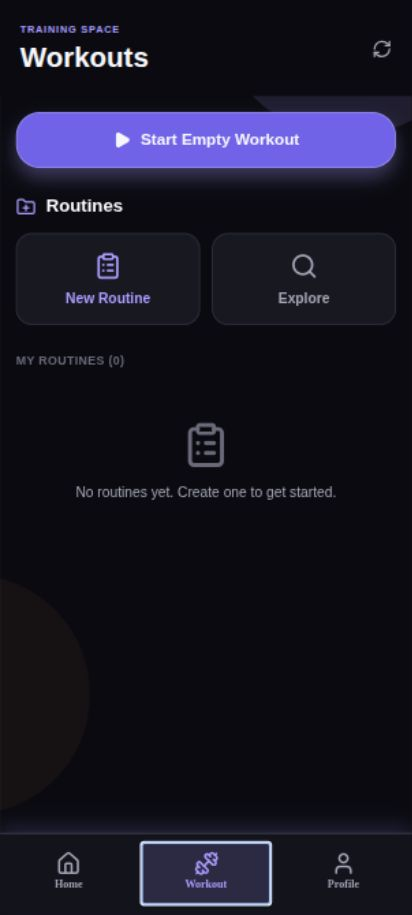
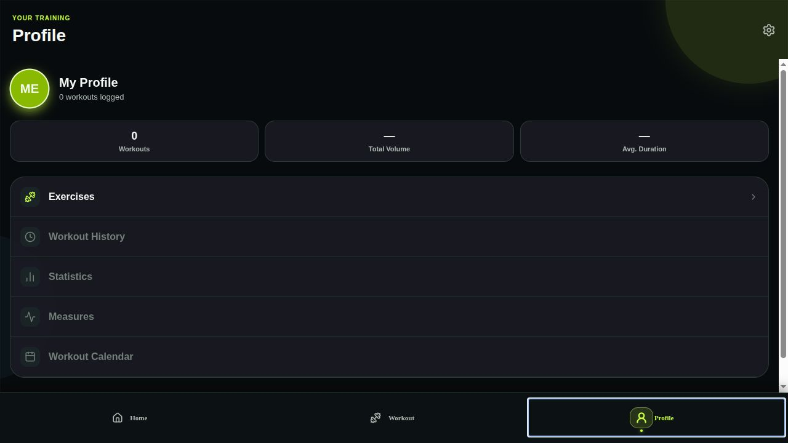
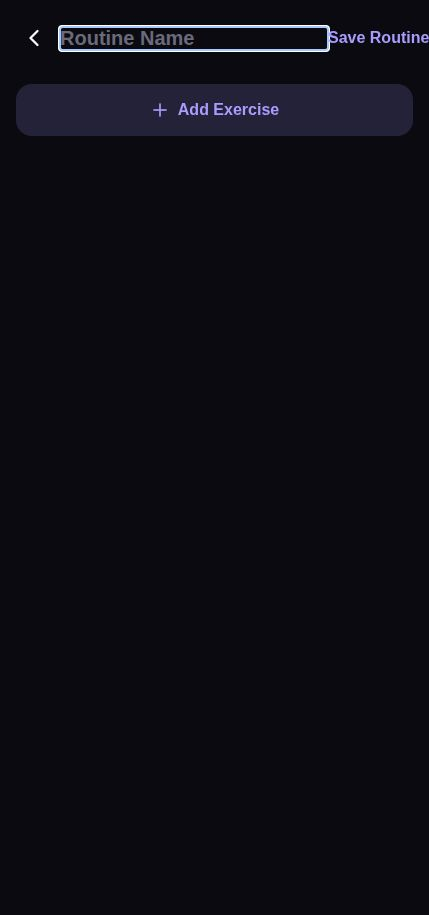
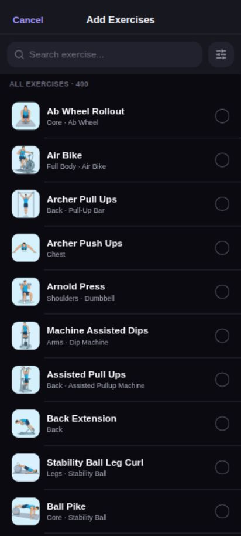
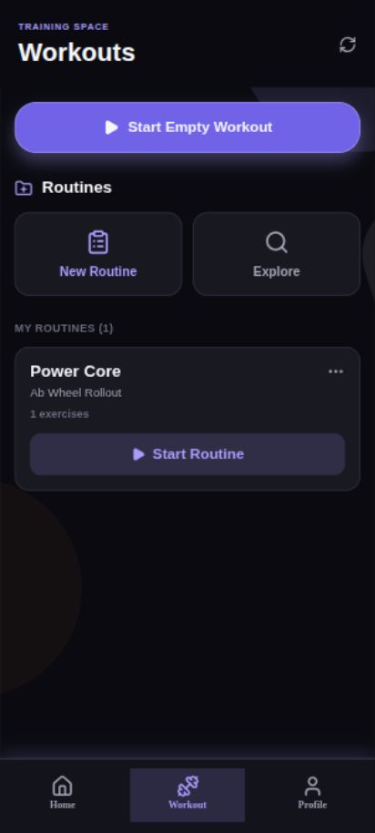
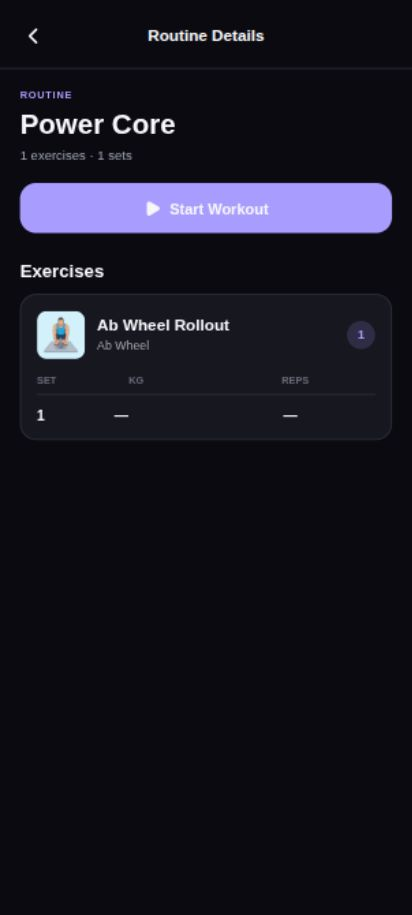
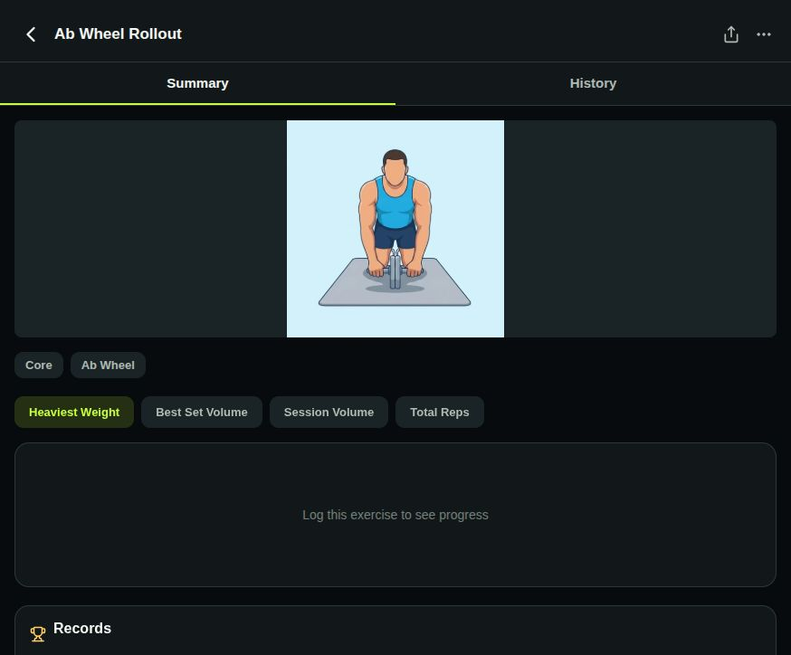

# HEAVY — Training Log

A polished Expo / React Native workout tracker for building routines, logging sets, and reviewing training progress.

[](https://github.com/s-a-m-y1/Gym-Traking-/raw/22c716e/releases/HEAVY-v1.0.0.apk)

**[Download the latest Android APK](https://github.com/s-a-m-y1/Gym-Traking-/raw/22c716e/releases/HEAVY-v1.0.0.apk)**

## Highlights

- Electric-lime gym visual system with cyan ambient lighting
- Native-driver entrance, pulse, glow, and tab-icon animations
- Build and run custom workout routines
- Browse 400 exercises with equipment and body-part filters
- Log weight, reps, set types, duration, and workout history
- Exercise detail screens with records, tips, and instructions

## Screens

| Home | Workouts | Profile |
| --- | --- | --- |
|  |  |  |

| Routine editor | Exercise picker | Routine details |
| --- | --- | --- |
|  |  |  |

| Workout logger | Exercise details |
| --- | --- |
|  |  |

## Run locally

```bash
npm install
npm run start
```

To build an installable Android APK:

```bash
npx eas-cli build --platform android --profile preview
```

## Stack

- Expo SDK 54
- React Native 0.81
- React Navigation
- Lucide React Native
- AsyncStorage
